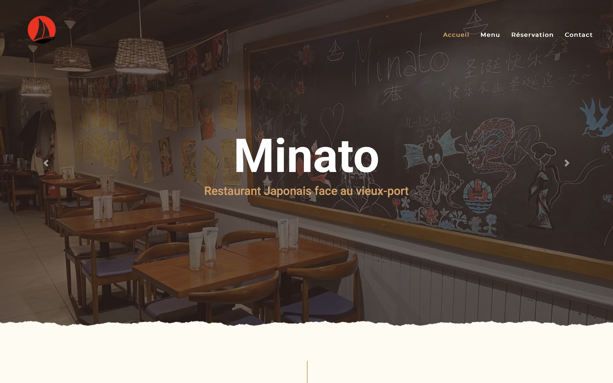
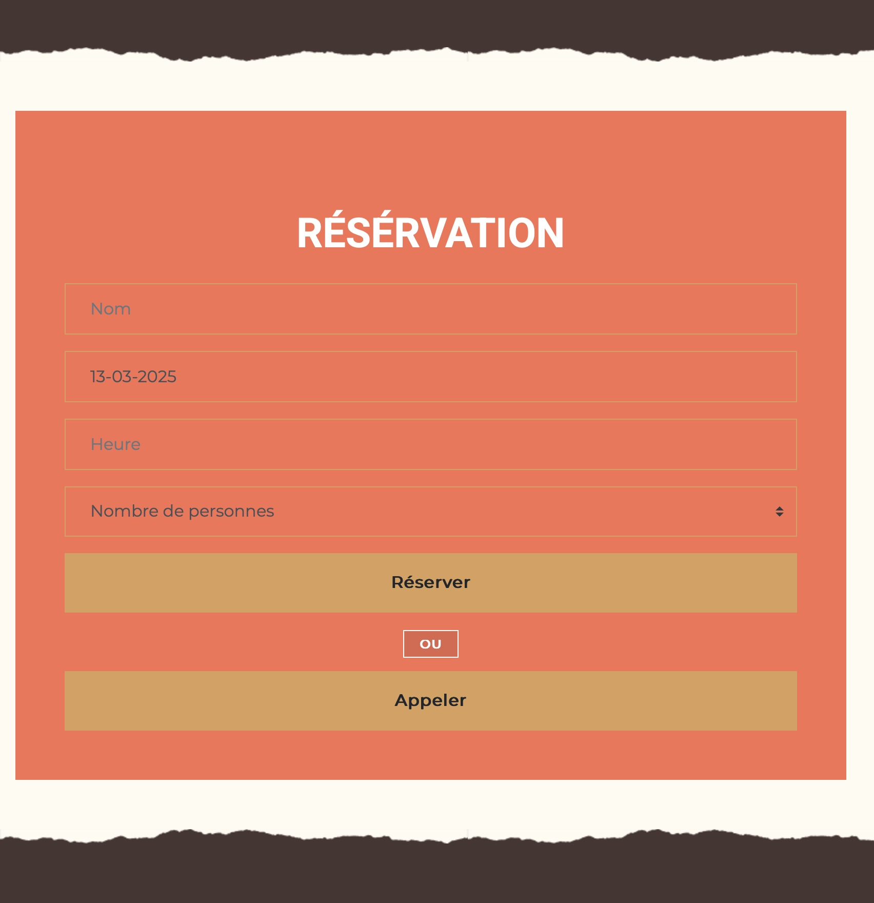
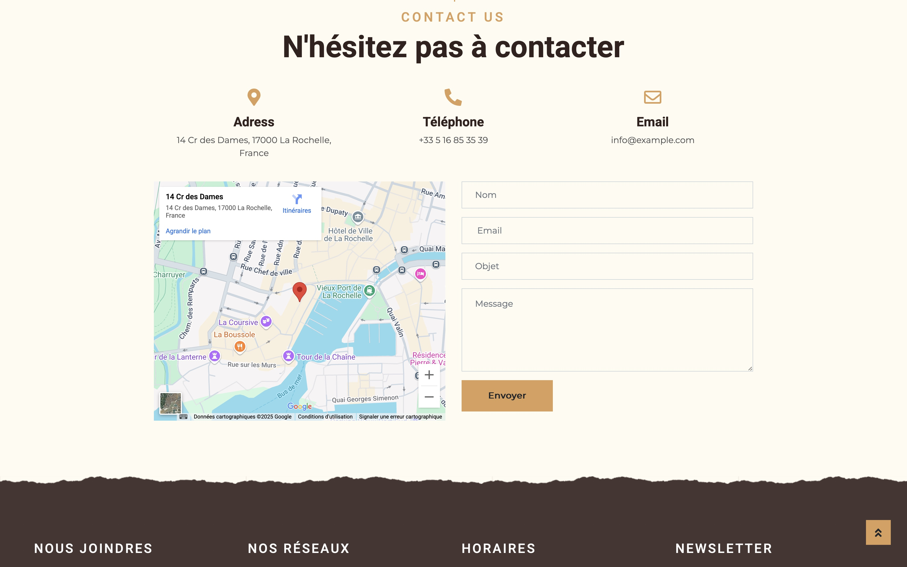

# Minato - Site Web Officiel

Minato est un site vitrine moderne conçu pour présenter l'univers et les services du restaurant japonais Minato. 
Travaillant à mi-temps dans ce restaurant en tant que job étudiant depuis trois ans, j'ai voulu contribuer à son développement en proposant au patron la création d'un site web. Il m'a partagé ses idées, que j'ai mises en place afin d'améliorer la visibilité et la gestion des réservations du restaurant.

Le site n'a pas pu être développé davantage par manque de temps, mais j'avais de nombreuses idées d'amélioration.

## 🖼️ Aperçu de l'application

    

## 🌟 Fonctionnalités principales
- **Page d'accueil immersive** avec une présentation du restaurant
- **Menu interactif** avec photos et descriptions des plats
- **Système de réservation en ligne** avec gestion en base de données
- **Galerie d'images** pour découvrir l'ambiance du restaurant
- **Formulaire de contact** pour toute demande client
- **Responsive Design** : Adapté à tous les écrans (mobile, tablette, desktop)

## 🚀 Technologies utilisées
- **Frontend** : HTML, CSS
- **Backend** : PHP
- **Base de données** : MySQL

## 🎨 UI/UX & Expérience utilisateur
- Design épuré et moderne
- Navigation fluide et intuitive
- Optimisation des performances pour un chargement rapide
- Accessibilité améliorée

---
✨ _Développé avec passion par Ali Essaadaoui_ ✨
